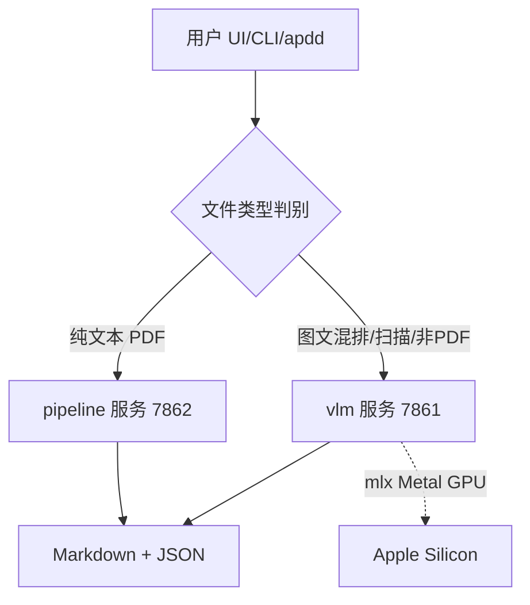

# minerU

MinerU——实用的文档解析工具：把 PDF / 图片 / DOCX / PPTX / XLSX 转成 Markdown 和 JSON。

> 🤖 Agent 上手先读 [`AGENTS.md`](./AGENTS.md) 的操作守则；改动后记得追加 [`CHANGELOG.md`](./CHANGELOG.md)（强标签格式见文件顶部）。

## 项目简介

上游 MinerU 的本机副本，部署为 Mac mini 算力服务：本机/局域网/服务器三方共享，把
PDF/图片/Office 转 Markdown+JSON。双服务架构——vlm（7861，mlx GPU，高精度）+ pipeline
（7862，纯文本快 6×），消费端按文件类型自动分流。

## 架构图



## 当前接力点 (Handoff)

### 概述
**装 persistence：sudo launchd/install.sh + .venv-pipeline python 加 TCC 完全磁盘访问**
**确认并处理 gradio_app.py 上轮遗留的未提交改动**
**commit 本会话改动（gradio UI 分流 + mineru-gradio.sh），当前在 worktree epic-haslett-436980**

### 明细
双服务分流已落地并端到端验证（UI 提交纯文本 PDF→7862→8s 完成，vs vlm 320s）。
vlm 无 GPU 提速旋钮（进程级串行锁），提速唯一杠杆=纯文本走 pipeline。
判别用上游 `mineru/utils/pdf_classify.py::classify()`。三服务当前临时 nohup，重启会丢。
详见 obwiki `sources/2026-06-14-mineru-gpu-perf-dual-service-routing.md`。

## 项目结构

```
minerU/
├── demo/         示例脚本与样本输入（PDF / Office 文档）
├── docker/       Docker compose 与构建镜像（china / global 两套）
├── docs/         mkdocs 文档站点源（中英双语）
├── mineru/       主 Python 包（backend / cli / data / model / resources / utils）
├── projects/     周边子项目（Gradio Web UI 等）
├── tests/        单元测试与覆盖率脚本
├── pyproject.toml         构建与依赖
├── mineru.template.json   配置样例
├── mkdocs.yml             文档站点配置
├── update_version.py      版本更新脚本
├── README.md / README_zh-CN.md
├── LICENSE.md / MinerU_CLA.md / SECURITY.md
└── .github/               CI 配置
```

## 子模块导航

| 路径 | 用途 |
|---|---|
| [`mineru/`](./mineru/) | 主 Python 包：`backend`（解析后端）/ `cli`（命令行入口）/ `data`（数据 IO）/ `model`（模型相关）/ `resources` / `utils` |
| [`projects/`](./projects/) | 周边子项目（含中英 README，未来可能拆为自带三件套的子项目） |
| [`scripts/local/`](./scripts/local/) | 本机算力服务启停脚本（`mineru-api.sh` / `mineru-gradio.sh` / `reverse-tunnel.sh`），详见 AGENTS "本机算力服务部署"段 |
| [`scripts/local/launchd/`](./scripts/local/launchd/) | LaunchDaemon plist 模板 + install/uninstall 脚本，详见 AGENTS "持久化（LaunchDaemon + TCC 必备）"段 |
| [`scripts/server/`](./scripts/server/) | 服务器侧 Traefik 路由 + socat 桥接 stack + basic-auth 生成脚本，详见 AGENTS "公网入口（服务器 Traefik + basic-auth）"段 |
| [`demo/`](./demo/) | `demo.py` + 样本 PDF / Office 文档，跑通效果用 |
| [`docker/`](./docker/) | `compose.yaml` + `china/` `global/` 两套镜像构建 |
| [`docs/`](./docs/) | mkdocs 文档源：`en/` `zh/` `assets/` `images/` `chemical_knowledge_introduction/` |
| [`tests/`](./tests/) | `unittest/` 套件 + `get_coverage.py` / `clean_coverage.py` |
| [`.github/`](./.github/) | GitHub workflows 与社区模板 |

## 本机算力服务（部署状态）

Mac mini 当算力机，本机 / 局域网 / 火山云服务器（经反向 SSH 隧道）三方共享。**取代了已弃用的 docling-serve 部署**。

| 入口 | 端口 | 状态 |
|---|---|---|
| Gradio Web UI | `0.0.0.0:7860` | ✅ 跑着（前台 nohup） |
| FastAPI / Swagger `/docs` | `0.0.0.0:7861` | ✅ 跑着（前台 nohup） |
| LAN 直连 `192.168.1.89:7860/7861` | — | ✅ 已通（防火墙放行 venv python） |
| 反向 SSH 隧道到 huoshan-server01 | `172.18.0.1:7860/7861`（docker_gwbridge） | ✅ 已通 |
| 公网 Gradio UI | `https://mineru-ui.alphaxbot.xyz` | ✅ 已通（basic-auth 拦截） |
| 公网 FastAPI / Swagger | `https://mineru-api.alphaxbot.xyz/docs` | ✅ 已通（basic-auth 拦截） |
| launchd 持久化 | `system/xyz.alphaxbot.mineru-{api,gradio,tunnel}` | ✅ LaunchDaemon 装好，Mac 重启自动起；需给 `/bin/zsh` + `~/.local/bin/python3.12` 加 FDA |

详见 AGENTS.md "本机算力服务部署"段。

## 常用操作

```bash
# 安装（开发模式）
pip install -e .

# 跑示例
python demo/demo.py

# 启动 Gradio Web UI（如 projects/ 下有对应入口，详见 projects/README.md）

# 跑测试
cd tests && python -m unittest discover unittest

# 文档预览
mkdocs serve

# Docker 启动（按地区选择）
cd docker && docker compose up
```

## 相关链接

- 📓 演绎记录：[CHANGELOG.md](./CHANGELOG.md)
- 🤖 Agent 守则：[AGENTS.md](./AGENTS.md)
- 📖 项目说明（英文）：[README.md](./README.md)
- 📖 项目说明（中文）：[README_zh-CN.md](./README_zh-CN.md)
- 📜 License：[LICENSE.md](./LICENSE.md) / CLA：[MinerU_CLA.md](./MinerU_CLA.md)
- 🔒 安全策略：[SECURITY.md](./SECURITY.md)
